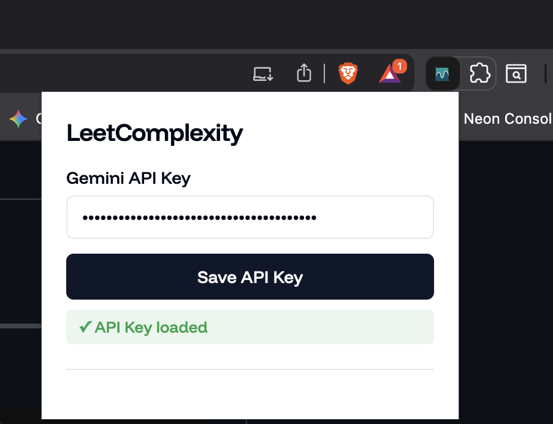

# LeetComplexity

A Chrome extension that analyzes the time complexity (TC) and space complexity (SC) of your LeetCode solutions using Google's Gemini AI.

---

## 📦 Installation

Follow these steps to load the extension in Chrome:

1. **Download or Clone** this repository to your local machine
2. Open Chrome and navigate to `chrome://extensions/`
3. Enable **Developer mode** (toggle in the top-right corner)
4. Click **Load unpacked**
5. Select the folder containing the extension files
6. The LeetCode TC extension should now appear in your extensions list

---

## 🚀 How to Use

### Step 0: Add Your API Key

1. Click on the **LeetComplexity** extension icon in your Chrome toolbar
2. Enter your **Google Gemini API Key** in the input field
3. Click **Save API Key**
4. You should see a success message confirming the key was saved

> **Note:** You can get a free API key from [Google AI Studio](https://makersuite.google.com/app/apikey)

---

### Step 1: Open a LeetCode Problem

1. Navigate to any LeetCode problem (e.g., `https://leetcode.com/problems/two-sum/`)
2. Write or paste your solution in the code editor
3. **Important:** Scroll the code editor to the top before clicking the analyze button
4. Look for the **graph/curve button** in the top control bar
5. Click the button to start analyzing your code

> **⚠️ Note:** Make sure to scroll your code editor to the top before clicking the analyze button. The extension will automatically scroll through your code, but starting from the top ensures all lines are captured correctly.

---

### Step 2: Wait for Analysis

1. A popup will appear in the bottom-right corner showing "Analyzing..."
2. The extension extracts your code from the Monaco editor
3. It sends the code to Google's Gemini API for complexity analysis
4. This usually takes 2-5 seconds

---

### Step 3: View Results

1. The popup updates with the analysis results
2. **Time Complexity** is displayed (e.g., O(n), O(n²), O(log n))
3. **Space Complexity** is displayed (e.g., O(1), O(n), O(n+m))
4. You can close the popup by clicking the **×** button

---

## 🛠️ Features

- ✅ Automatic code extraction from LeetCode's Monaco editor
- ✅ AI-powered complexity analysis using gemini-2.5-flash
- ✅ Beautiful, animated popup with dark mode support
- ✅ Secure API key storage using Chrome's sync storage
- ✅ Clean, modern UI styled with shadcn design system
- ✅ Funnel Display typography for better readability

---

## 🔒 Privacy

- Your API key is stored locally using Chrome's secure storage
- Code is only sent to Google's Gemini API for analysis
- No data is stored or shared with third parties

---

## 🐛 Troubleshooting

**Extension not working?**

- Make sure you've added a valid API key
- Check that you're on a LeetCode problem page
- Ensure the Monaco editor is fully loaded

**Analysis failed?**

- Verify your API key is correct
- Check your internet connection
- Look at the browser console (F12) for error messages

---

## 📄 License

MIT License - feel free to use and modify!

---

Made with ❤️ for LeetCode enthusiasts
